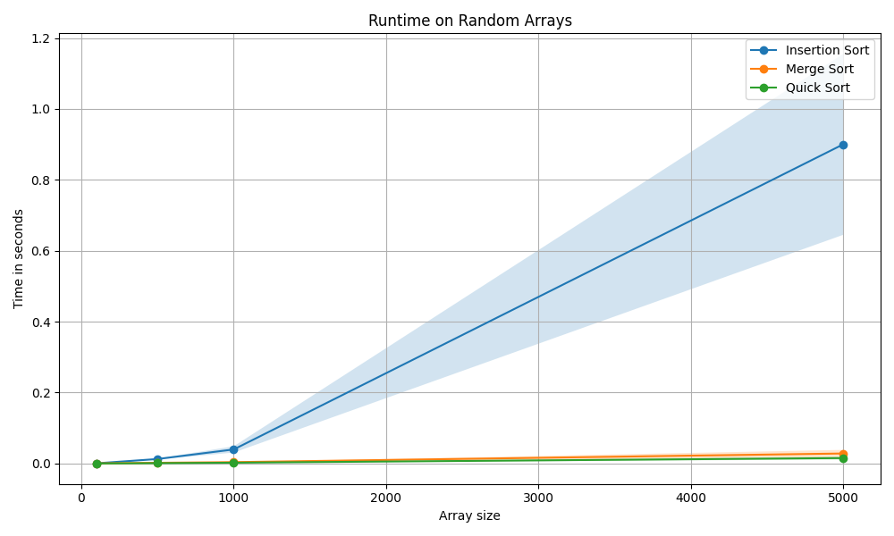
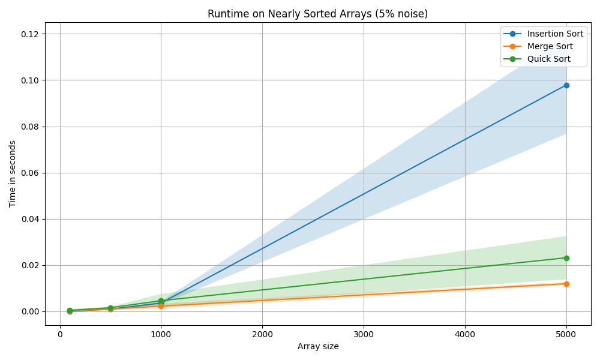

# Sorting Assignment

## Student Name
Lee Dotan

## Selected Algorithms
- Insertion Sort
- Merge Sort
- Quick Sort

## Result 1

This figure shows the running times of the three algorithms on random arrays.

Insertion Sort becomes much slower when the array size gets bigger.

Merge Sort and Quick Sort are much faster on larger arrays.

## Result 2

This figure shows the running times of the same algorithms on nearly sorted arrays.

Insertion Sort is faster here than in the first experiment because the array is already close to sorted.

Merge Sort stays efficient and is less affected by the original order of the array.

Quick Sort also performs well, although in this experiment it was a little slower than Merge Sort.

Compared to result1, the running times changed because the input in result2 was nearly sorted instead of random. This especially helped Insertion Sort.